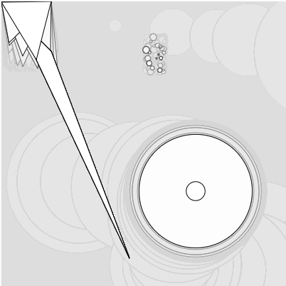

# Unidad 1

## 🔎 Fase: Set + Seek

### Actividad 1
#### ¿Qué es un sistema físico interactivo?  
Es un sistema por el cual desde la interaccion del usuario con las herramientas provistas, es posible afectar el proceso del sistema sin crear directamente el resultado del mismo  
#### ¿Cómo podrías aplicar lo que has visto en tu perfil profesional?  
  
### Actividad 2  
#### ¿Qué es el diseño/arte generativo?  
Es arte que se crea a partir de un proceso con reglas definidas con tal de materializar ideas, aqui la idea no es el resultado final si no lo que define el sistema por el cual se crea
#### ¿Cómo podrías aplicar lo que has visto en tu perfil profesional?  
  
### Actividad 3  
#### En estos sistemas físicos interactivos identifica los inputs, outputs y el proceso.  
Input: Computador 1(Web Serial/puerto USB, boton "Send Love") y Computador 2 (Botones(A/B), Acelerometro, puerto USB) 
Output: Computador 1(Pantalla, Web Serial(datos)) y Computador 2 (puerto USB(datos), Pantalla)   
Proceso: Computador 1 (presionar boton "Send Love"(mostrar corazon -> cara feliz)) y Computador 2 
(presionar boton A (generar color rojo + mostrar letra "A")/boton B(generar color amarillo + mostrar letra "B"), agitar Acelerometro(generar color verde))  
  
### Actividad 4  
Crea tu propio programa en p5.js 
[My Ride](https://editor.p5js.org/RonEduPraGar/sketches/i-uNj39De)  

  ``` js
function setup() {
  createCanvas(400, 400);
  //console.log("dadadada");
}

function draw() {
  t=0;
  background(220,15);
  triangle(20,20,70,70,180,360);
  circle(mouseX,mouseY,random(3,200));
  circle(random(3,30)+200, random(50,100), random(1,10));
  triangle(sin(t),cos(t), random(1,80), random(50, 100), 70, tan(t));
  t++;
}
  ```

### Actividad 5
#### Explica cómo funciona el sistema físico interactivo que acabamos de crear.
Este sistema funciona con base en la conexion que puede tener el micro:bit directamente con el programa/editor de p5.js, 
con base en esto, se sube una funcionalidad de lectura de las acciones ejectudas en el microbit, 
especificamente la interaccion con el boton A y que hacer cuando se ejecuta cualquier otra accion, una manera primitiva pero que asegura que se tenga acceso a ambos comandos en todo momento,
luego se le pone una pausa para controlar el flujo de datos.


