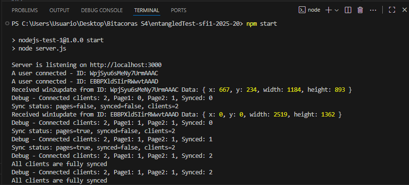
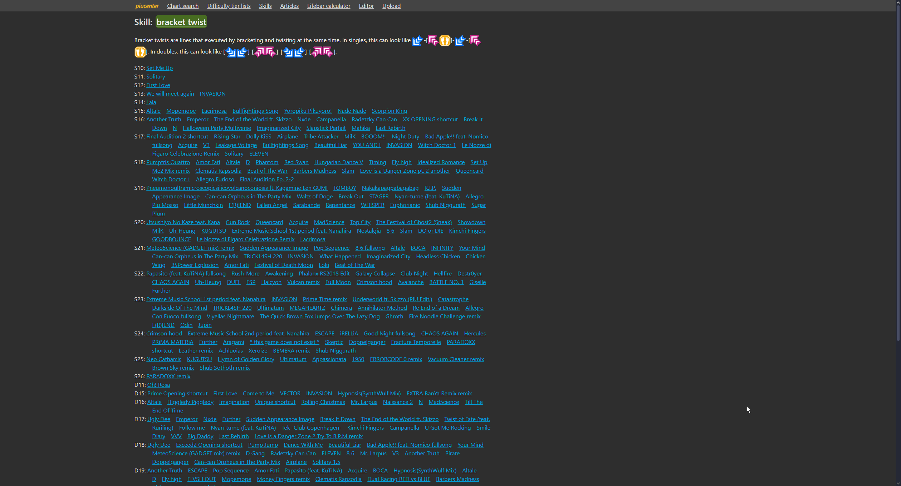
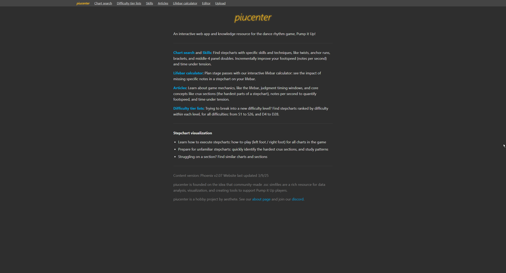

# Evidencias de la unidad 6
## Actividad 1
### Preparacion del entorno y primer contacto
#### 🎯 Enunciado
Antes de sumergirnos en el código, vamos a preparar nuestro entorno de desarrollo y ejecutar el caso de estudio base. Es crucial entender cómo poner en marcha el sistema completo.
##### ¿Qué ocurrió en la terminal cuando ejecutaste npm install? ¿Cuál crees que es su propósito?
Se crearon todos los archivos necesarios para el funcionamiento de lo que creeria es el sistema del servidor, permitiendo su fucionamiento y el de toda funcionalidad asociada a Node.js.
##### ¿Qué mensaje específico apareció en la terminal después de ejecutar npm start? ¿Qué indica este mensaje?
La confirmacion del funcionamiento del servidor, con una entrada de texto que indica el puerto al que se esta proyectando el caso de estudio, esta entrada es parte del codigo de server.js.
Inmediatamente despues de este mensaje de confirmacion, describe los clientes conectados, su serial de identificacion y describe cuando recibe actualizaciones, si los clientes estan alineados y algo sobre su estado actual.

##### Describe lo que ves inicialmente en page1 y page2 en tu navegador.
Son esferas iguales en ambas paginas, conformadas de un punto central y un borde de color gris, con relleno rojo en un fondo blanco.
##### ¿Qué mensajes aparecieron en la terminal del servidor cuando abriste page1 y page2?
Inmediatamente despues del mensaje de confirmacion, se describe los clientes conectados con su serial de identificacion y describe cuando recibe actualizaciones, si los clientes estan alineados y algo sobre su estado actual (si estan activos o no).
##### Describe qué sucede en ambas páginas del navegador cuando mueves una de las ventanas. ¿Cambia algo visualmente? ¿Qué mensajes aparecen (si los hay) en la consola del navegador (usualmente accesible con F12 -> Pestaña Consola) y en la terminal del servidor?
Se crea una conexion entre las 2 paginas desde el punto central, que ahora forma una linea que por el efecto de usar ventanas parece estar siempre encima de la ventana que esta por debajo, en el caso de que no se este mostrando el centro de la ventana en movimiento, ambas ventanas realmente tienen los 2 circulos, lo unico que cambian es la distancia entre estos con la separacion de sus centros.
La consola del navegador muestra el estado de coneccion y si existen problemas con esto, mientras que la terminal muestra los datos recibidos y el estado de actividad de los elementos que conforman la interaccion y de su sincronizacion.

## Actividad 2
#### 🎯 Enunciado
Antes de sumergirnos en el código específico de nuestro caso de estudio, vamos a hacer un viaje conceptual.
##### Piensa en cómo te conectas a Internet en casa o en la Universidad. ¿Usas Wi-Fi? ¿Un cable de red? Eso es simplemente tu “rampa de acceso” a la gran red de carreteras. ¿Qué pasaría si esa rampa se corta? Anota tus ideas.
Por ambos metodos, cuando esta rampa desaparece, la informacion deja de fluir, no hay actualizaciones, en algunos casos se queda en lo ultimo que recuerde, en otros causa error o no permite entrada a lo que requiera la conexion, puede que los sistemas tengan medidas para evitar problemas, o incluso que guarden parte de la informacion para generar funcion limitada de los elementos en funcion.
##### ¿Puedes identificar otros ejemplos de relaciones Cliente-Servidor en tu vida diaria (no necesariamente digitales)? Por ejemplo, al pedir comida en un restaurante. ¿Quién es el cliente y quién el servidor? ¿Qué se pide y qué se entrega?
En cosas como los sistemas de identificacion de la universidad, donde las pantallas o camaras son los clientes, los cuales envian la informacion (en este caso imagen del codigo QR o nuestras caras), para que luego sea verificada en el servidor y devuelta al cliente en forma de confirmacion para que permitan la entrada al usuario. En el caso del restaurante diria que el cliente es quien toma la orden y el servidor es quien cocina, a este cocinero se le entrega las peticiones, a partir de las cuales ejecuta una serie de instrucciones con las cuales genera lo pedido lo que entrega al cliente (quien toma la orden) para que se lo entregue al cliente (quien pide la comida). 
##### Toma la URL de tu sitio web favorito. Intenta identificar el protocolo, el nombre de dominio y la ruta (si la hay). ¿Qué crees que pasa si solo escribes el nombre de dominio (ej. www.google.com) sin una ruta específica? ¿Qué “página por defecto” crees que te envía el servidor?
https://www.piucenter.com/skill/bracket_twist

https:// - protocolo
www.piucenter.com - dominio
./skill/bracket_twist - ruta
Escribir el dominio directamente, lleva a la pagina base del sitio.

##### Compara HTTP con los protocolos seriales que usaste.
Comparado con ASCII y Binario con framing, este protocolo permite un envio de informacion mas exacto, ya sea en cantidad o seguridad, donde este envia un paquete que incluye lo necesario para su funcionamiento con las intenciones de su uso y sus contenidos limitados bajo etiquetas del tipo de archivo.  
##### ¿Qué similitudes encuentras?
El requerimiento de delimitacion de los paquetes para la lectura de los datos y los envios y recepciones de mensajes.
##### ¿Qué diferencias clave ves?
La definicion de un tipo de intencion/archivo para recibir/enviar el paquete, el tamaño del paquete (siendo este posiblemente un archivo de informacion en vez de bits en cantidades exactas)
##### ¿Por qué crees que HTTP necesita ser más complejo que un simple envío de bytes como hacías con el micro:bit?
Esto posiblemente debido a la cantidad de informacion y las difencias en el numero de bites procesados, ademas de la necesidad de asignar los archivos a diferentes aspectos de las aplicaciones o paginas.
##### Piensa en una página web simple, como un formulario de login.
##### ¿Qué parte crees que es HTML (ej. los campos de texto, el botón)?
La parte que dibuja o define el sitio, en este caso los campos de texto de usuario y contraseña y los botones de acceso
##### ¿Qué parte es CSS (ej. el color del botón, el tipo de letra)?
La parte que maneja los objetos puramente graficos (formas, efectos, tipos de letra, colores, transparencias, aspecto grafico de objetos interactivos), en este caso los colores de los campos de texto y el tipo de letra dentro de estos y los botones, asi como los colores del boton y sus cambios de color en interaccion
##### ¿Qué parte es JavaScript (ej. la comprobación de si escribiste algo antes de enviar, el mensaje de “contraseña incorrecta” que aparece sin recargar la página)?
Todo lo que identifica y traduce las interacciones del usuario en informacion utilizable dentro del sitio, expandiendo su funcionalidad. En este caso, la comparacion de la informacion y la autorizacion de acceso al sitio.
##### Compara el bucle draw() de p5.js con este modelo de “esperar a que algo pase y reaccionar”.
##### ¿Qué ventajas crees que tiene el modelo basado en eventos para una interfaz de usuario web?
Primero, un ahorro de recursos, usando solo los necesarios para ejecutar un evento, permitiendo tambien un enfoque en funciones eficientes y modulares
##### ¿Sería eficiente tener un bucle draw() redibujando toda la página 60 veces por segundo si nada ha cambiado?
Seria un desperdicio de poder de procesamiento y memoria, cuando esto puede funcionar sin estar en un constante bucle.
##### ¿Por qué crees que podría ser útil usar JavaScript tanto en el cliente (navegador) como en el servidor? ¿Se te ocurre alguna ventaja para los desarrolladores?
Consistencia, al ser el mismo formato permite un trabajo mas fluido y unificado entre los diferentes archivos sin requerir el doble de investigacion y conocimiento, tambien permite la conexion entre ambos aspectos (cliente y servidor) sin requerir cambios o traducciones intermedias, reduciendo la carga en terminos de codigo.
##### Resume con tus propias palabras la diferencia fundamental entre una comunicación HTTP tradicional y una comunicación usando WebSockets/Socket.IO. ¿En qué tipo de aplicaciones has visto o podrías imaginar que se usa esta comunicación en tiempo real?
En HTTP siempre es necesario recibir un mensaje antes de enviar uno, siempre se depende de un ciclo de envios y esperas, en comparacion, los Sockets son una conexion constante, siempre disponibles para enviar o recibir informacion, ambos tipos creo que son observables en aplicaciones de reproduccion de video online como youtube, donde las paginas funcionan con una base de HTML, pero funciones como la reproduccion de videos o previews son mas comparables al tipo de comunicacion de WebSockets/Socket.IO.
## Actividad 3
#### 🎯 Enunciado
Analizaremos juntos el código del servidor server.js línea por línea.
##### 🧐🧪✍️ Experimenta

Detén el servidor si está corriendo.

Cambia la primera ruta de /page1 a /pagina_uno.

Inicia el servidor.

Intenta acceder a http://localhost:3000/page1. ¿Funciona? 

Ahora intenta acceder a http://localhost:3000/pagina_uno. ¿Funciona?

¿Qué te dice esto sobre cómo el servidor asocia URLs con respuestas? Restaura el código.
##### 🧐🧪✍️ Experimenta

Asegúrate de que el servidor esté corriendo (npm start).

Abre http://localhost:3000/page1 en una pestaña. Observa la terminal del servidor. ¿Qué mensaje ves? Anota el ID.

Abre http://localhost:3000/page2 en OTRA pestaña. Observa la terminal. ¿Qué mensaje ves? ¿El ID es diferente?

Cierra la pestaña de page1. Observa la terminal. ¿Qué mensaje ves? ¿Coincide el ID con el que anotaste?

Cierra la pestaña de page2. Observa la terminal.
##### 🧐🧪✍️ Experimenta

Inicia el servidor y abre page1 y page2.

Mueve la ventana de page1. Observa la terminal del servidor. ¿Qué evento se registra (win1update o win2update)? ¿Qué datos (Data:) ves?

Mueve la ventana de page2. Observa la terminal. ¿Qué evento se registra ahora? ¿Qué datos ves?

Experimento clave: cambia socket.broadcast.emit(‘getdata’, page1); por socket.emit(‘getdata’, page1); (quitando broadcast). Reinicia el servidor, abre ambas páginas. Mueve page1. ¿Se actualiza la visualización en page2? ¿Por qué sí o por qué no? (Pista: ¿A quién le envía el mensaje socket.emit?). Restaura el código a broadcast.emit.
##### 🧐🧪✍️ Experimenta

Detén el servidor.

Cambia const port = 3000; a const port = 3001;.

Inicia el servidor. ¿Qué mensaje ves en la consola? ¿En qué puerto dice que está escuchando?

Intenta abrir http://localhost:3000/page1. ¿Funciona?

Intenta abrir http://localhost:3001/page1. ¿Funciona?

¿Qué aprendiste sobre la variable port y la función listen? Restaura el puerto a 3000.
## Actividad 4
### Explorando los clientes (p5.js + Socket.IO)
#### 🎯 Enunciado
Ahora nos enfocaremos en cómo uno de los clientes, page2.js, interactúa con el servidor y visualiza la información. El código de page1.js es muy similar, así que entender uno te ayudará a entender el otro.
##### 🧐🧪✍️ Experimenta

Abre page2.html en tu navegador (con el servidor corriendo).

Abre la consola de desarrollador (F12).

Detén el servidor Node.js (Ctrl+C).

Refresca la página page2.html. Observa la consola del navegador. ¿Ves algún error relacionado con la conexión? ¿Qué indica?

Vuelve a iniciar el servidor y refresca la página. ¿Desaparecen los errores?
##### 🧐🧪✍️ Experimenta

Comenta la línea socket.emit(‘win2update’, currentPageData, socket.id); dentro del listener connect.

Reinicia el servidor y refresca page1.html y page2.html.

Mueve la ventana de page2 un poco para que envíe una actualización.

¿Qué pasó? ¿Por qué?
##### 🧐🧪✍️ Experimenta

Abre ambas páginas (es posible que ya las tengas abiertas).

Mueve la ventana de page1. Observa la consola del navegador de page2. ¿Qué datos muestra?

Mueve la ventana de page2. Observa la consola de page1. ¿Qué pasa? ¿Por qué?
##### 🧐🧪✍️ Experimenta

Observa checkWindowPosition() en page2.js y modifica el código del if para comprobar si el código dentreo de este se ejecuta.
Mueve cada ventana y observa las consolas.
¿Qué puedes concluir y por qué?
##### 🧐🧪✍️ Experimenta
(¡Sé creativo!)

Cambia el background(220) para que dependa de la distancia entre las ventanas. Puedes calcular la magnitud del resultingVector usando let distancia = resultingVector.mag(); y luego usa map() para convertir esa distancia a un valor de gris o color. background(map(distancia, 0, 1000, 255, 0)); (ajusta el rango 0-1000 según sea necesario).

Inventa otra modificación creativa.
## Actividad 5
#### 🎯 Enunciado
Basado en la infraestructura de comunicación del caso de estudio vas a crear tu propia aplicación interactiva en tiempo real. Diseño algo completamente nuevo usando la misma tecnología de comunicación. ¡Sé creativo! Quiero insistirte con algo. No se trata de solo cambiar el diseño o la apariencia de la aplicación. Se trata de crear algo nuevo, diferente y original.