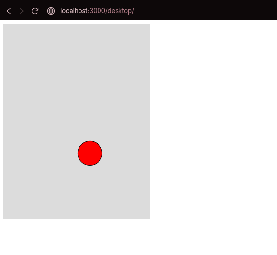
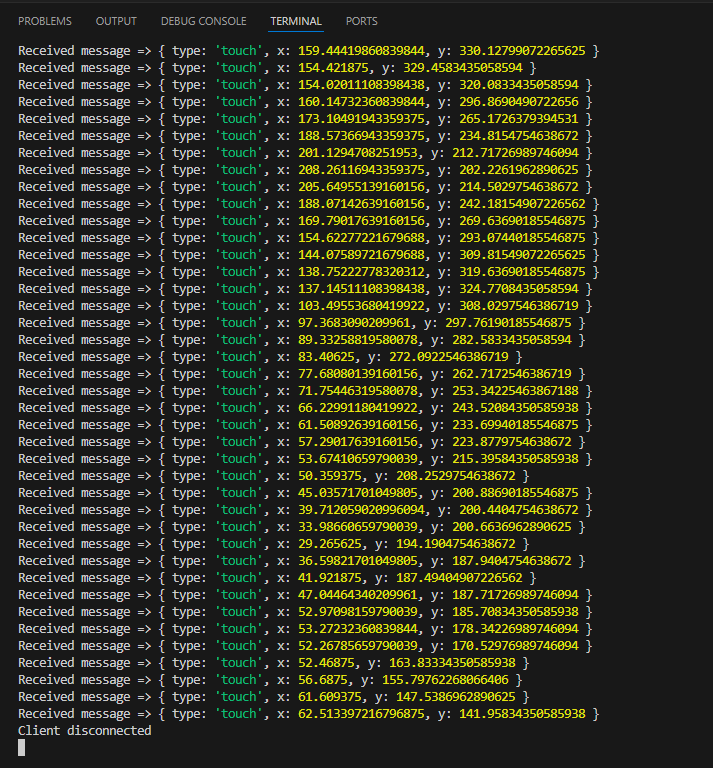
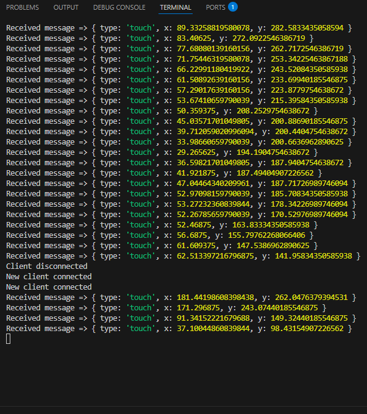
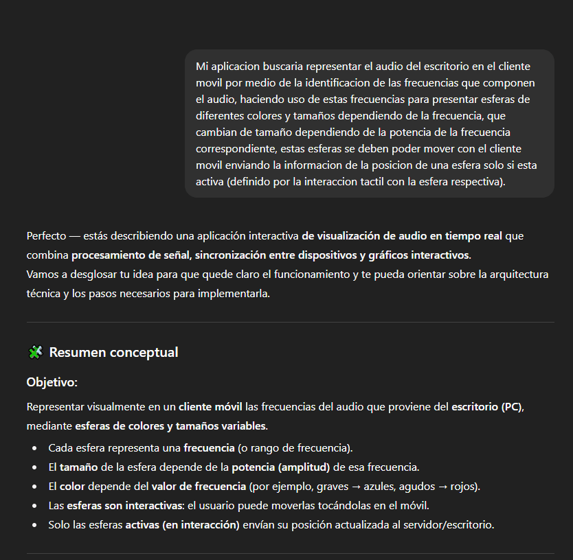
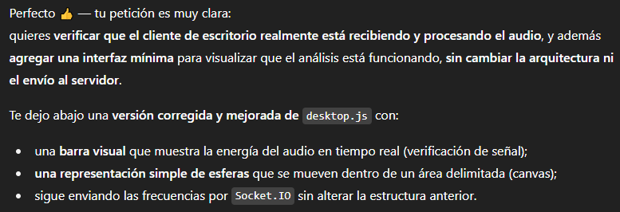

# Evidencias de la unidad 7
  
## Actividad 01
  
### 🎯 Enunciado
  
Vamos a configurar y ejecutar el caso de estudio base. El objetivo es lograr que la interacción táctil en una página web abierta en tu celular controle en tiempo real un círculo en una página web abierta en el navegador de tu computador. Usaremos Node.js como intermediario y VS Code Dev Tunnels para hacer posible la conexión entre ambas aplicaciones.
  
### 🧐🧪✍️ Reporta en tu bitácora
  
#### ¿Qué URL de Dev Tunnels obtuviste? ¿Por qué crees que necesitamos usar esta URL en lugar de http://localhost:3000 o la IP local de tu computador para que el celular se conecte?
El URL provisto por Dev Tunnels es https://7rc559gm-3000.use.devtunnels.ms//mobile/, o mas especificamente, https://7rc559gm-3000.use.devtunnels.ms, este link es necesario debido a que no hay manera de acceder a un localhost (esta en el nombre, es una instancia local dentro del sistema que en este caso, es el computador) que no sea por medio de un intermediario si se busca su funcionamiento en otros dispositivos, estos sistemas en su forma inicial no tienen una entrada externa que permita su interaccion con todo dispositivo o sistema aparte al original.
  
#### Describe brevemente qué hace npm install y npm start.
npm install, instala todas las dependencias y requerimientos que permiten crear el servidor, npm start crea el servidor y lo asocia a un URL y puerto, produciendo el codigo necesario en el proceso.
    
#### ¿Qué mensajes observaste en la terminal del servidor al conectar el cliente de escritorio y el cliente móvil? ¿Eran diferentes los mensajes o identificadores?
Cuando se da la conexion es posible ver el identificador que establece una conexion correcta, seguido inmediatamente de la recepcion de los mensajes enviados desde el sitio de celular, los cuales muestran el tipo de interaccion utilizado (touch) y las coordenadas dentro del recuadro de control (x/y).
  
#### Describe el comportamiento observado: ¿Funcionó la interacción? ¿Hubo algún retraso (latencia)?
La interaccion funciona y los comandos o mensajes enviados al servidor existen a la par del movimiento de la esfera, el retraso es imperceptible a primera vista, aunque durante la interaccion es posible observar que solo se registran/envian mensajes durante el *movimiento* del dedo con el cual se este interactuando con la aplicacion, lo que permite "teletransportar" la imagen entre diferentes posiciones del recuadro.  
  
  
## Actividad 02
  
### 🎯 Enunciado

Antes de analizar el código línea por línea, vamos a clarificar los conceptos nuevos o críticos específicos de esta unidad que permiten la comunicación entre tu celular y tu computador a través de Internet.
  
### 🧐🧪✍️ Reporta en tu bitácora
  
#### Explica con tus propias palabras: ¿Por qué es necesario Dev Tunnels en este escenario y cómo funciona conceptualmente?
Dev Tunnels podria considerarse como el sistema que crea una puerta por la cual sea posible acceder a la informacion dentro del entorno cerrado en el que se esta trabajando, ya que este existe sin su intervencion solo dentro del sistema que lo crea, usar el mismo link inicial que se crea para las pruebas solo lleva a la instancia de ese link que exista dentro de un diferente dispositivo, que en la mayoria de los casos, no llevan a ninguna parte ya que no estan en uso. Conceptualmente, creeria que el sistema crea un espacio por el cual sea posible enviar y recibir informacion, para poder llevar las versiones correspondientes del sitio a cada dispositivo, a la vez que mantiene la conexion que permite su funcionamiento simultaneo.
  
#### Describe la función de touchMoved() y por qué se usa la variable threshold en el cliente móvil.
En este caso, la funcion touchMoved() es la funcion que determina la posicion del punto de interaccion dentro de la version movil del sitio, tomando la posicion actual y la posicion final de interaccion, tomando su diferencia de coordenadas como una variable de distancia de desplazamiento, con la cual hace uso de la variable de threshold (umbral/limite) para generar una comparacion bajo la cual define cuando detecta/inicia el proceso de envio de informacion, a partir del cual empieza a transmitir la informacion de las coordenadas a su otra version(escritorio), cuando esta condicion deja de ser verdadera, el sistema registra la ultima posicion del circulo.

#### Compara brevemente Dev Tunnels con simplemente usar la IP local. ¿Cuáles son las ventajas y desventajas de cada uno?
Podemos empezar por la seguridad del proceso, si es posible hacer el test dentro del mismo dispositivo se evita el ingreso o salida de informacion del sistema, lo que niega cualquier riesgo en caso de malas intenciones por individuos que tengan idea de ese canal abierto por medio de Dev Tunnels. De esa misma manera, usando la Ip local no seria posible probar diferentes dispositivos en el caso de conexiones o interactividad entre diferentes entornos o versiones de una aplicacion o sitio, la falta de variacion y consideracion de diferentes condiciones en las que se prueben estas aplicaciones, puede llevar a inconsistencias o problemas que pueden no ser identificados y que puedan ser fatales en la funcionalidad de las aplicaciones cuando sean expuestos a estas diferentes condiciones en su version final.

#### Coloca en tu bitácora capturas de pantalla del sistema completo funcionando. Esto lo puedes hacer abriendo tanto el mobile como el desktop en tu computador y tomando una captura de pantalla de todos los involucrados (celular, computador y terminal).

  

## Actividad 03
### 🎯 Enunciado
  
Vamos a analizar el código server.js. Este script actúa como un repetidor simple pero esencial, recibiendo mensajes del cliente móvil y retransmitiéndolos al cliente de escritorio.
  
### 🧐🧪✍️ Reporta en tu bitácora
  
#### ¿Cuál es la función principal de express.static(‘public’) en este servidor? ¿Cómo se compara con el uso de app.get(‘/ruta’, …) del servidor de la Unidad 6?
El uso del express.static() permite el acceso a todos los archivos dentro de la ruta especificada para el correcto funcionamiento del sito, que en este caso es la carpeta "public". Esta funcion se diferencia del app.get() en que no busca una ruta o archivo exacto, sino que obtiene todo lo que esta debajo de ese origen (incluyendo al cliente movil y de escritorio sin usar mas de una linea de codigo) con tal de que siempre sean accesibles, el app.get() trae los archivos a funcion en el momento en que son llamados por esta. 
  
#### Explica detalladamente el flujo de un mensaje táctil: ¿Qué evento lo envía desde el móvil? ¿Qué evento lo recibe el servidor? ¿Qué hace el servidor con él? ¿Qué evento lo envía el servidor al escritorio? ¿Por qué se usa socket.broadcast.emit en lugar de io.emit o socket.emit en este caso?
El evento que lo envia es el socket.emit(), mientras que el servidor lo recibe con el socket.on() el cual al recibir el mensaje muestra en consola la confirmacion de recibido y luego usa el socket.broadcast.emit() para enviar el mensaje al escritorio, donde es recibido y convertido en los datos de coordenadas.  
Se usa el socket.broadcast.emit debido a que estos mensajes son transmitidos a todos los clientes excepto por su emisor (en este caso, el mensaje llega al servidor y sale al cliente movil y el de escritorio), siendo esta informacion relevante a ambos clientes, mientras que las otras 2 funciones envian esta informacion a conexiones especificas, que en nuestro caso no tiene un uso dentro de servidor, pero que se usa en el cliente movil para enviar al servidor especificamente la informacion.  
  
#### Si conectaras dos computadores de escritorio y un móvil a este servidor, y movieras el dedo en el móvil, ¿Quién recibiría el mensaje retransmitido por el servidor? ¿Por qué?
El mensaje es recibido por el computador que sirva de host para el servidor, en otras palabras, el computador originario de la señal, esto debido a que es la fuente de la señal, mientras que el dispostivo movil la recibe y es este el que completa la interaccion. Consideraria que esto se da porque esta informacion emitida por el cliente movil se envia de forma directa al servidor, pero no estoy seguro de si es una cuestion de que no estaria bien establecida la conexion multiple, o simplemente respondi de forma opuesta a la realidad (no tengo acceso a un 3er dispositivo en el momento de desarrollo de la bitacora).
  
#### ¿Qué información útil te proporcionan los mensajes console.log en el servidor durante la ejecución?
Permiten reconocer:
* Puerto activo y su hipervinculo local
* Conexion y Desconexion de dispositivos/navegadores
* Transferencia correcta de datos (Mensajes recibidos y/o errores en conexion)  

## Actividad 04
  
### 🎯 Enunciado
  
Ahora analizaremos el código que corre en los navegadores: el cliente móvil que captura el toque (mobile/sketch.js) y el cliente de escritorio que recibe la información y dibuja (desktop/sketch.js). Veremos cómo usan Socket.IO para comunicarse con el servidor.
  
### 🧐🧪✍️ Reporta en tu bitácora
  
#### Realiza un diagrama donde muestres el flujo completo de datos y eventos entre los tres componentes: móvil, servidor y escritorio. Puedes ilustrar con un ejemplo de coordenadas táctiles (x, y) y cómo viajan a través del sistema.
  
  
  
## Actividad 05
  
### Aplica lo aprendido
### 🎯 Enunciado
  
Ahora que comprendes cómo funciona el sistema base, es tu turno de CREAR
  
### 🧐🧪✍️ Reporta en tu bitácora
  
#### Diseña una aplicación interactiva que use el touch del móvil para controlar una visuales de tema musical de tu elección. Las visuales correrán en una aplicación de escritorio (desktop). Recuerda que ambas aplicaciones las construirás usando p5.js y utilizando el servidor Node.js como puente.  
Mi aplicacion buscaria representar el audio del escritorio en el cliente movil por medio de la identificacion de las frecuencias que componen el audio, haciendo uso de estas frecuencias para presentar esferas de diferentes colores y tamaños dependiendo de la frecuencia, que cambian de tamaño dependiendo de la potencia de la frecuencia correspondiente, estas esferas se deben poder mover con el cliente movil enviando la informacion de la posicion de una esfera solo si esta activa (definido por la interaccion tactil con la esfera respectiva).
#### Implementa tu diseño. Puedes usar IA generativa para ayudarte a escribir el código, pero primero debes hacer el diseño de lo que quieres.
Con tal de tener una base sobre la cual trabajar y tambien de conocer o entender funciones con las que no he trabajado previamente dentro de Python y en Node.js, se hizo uso de ChatGPT.
Se uso el diseño de la aplicacion descrita en la primera parte, con lo cual ChatGPT establecio una explicacion basica de los posibles requerimientos de una aplicacion de este tipo de forma general

Luego, se le pide a ChatGPT crear un diagrama con base en la infraestructura de Node.js, y termina creando la primera* (segunda, debido a que la primera vez no genero por completo y cambio todo en el reintento) version del proyecto en el proceso, aunque aun los considera "ejemplos".

Ya con tal de probar la efectividad del "experimento", se crea una copia directa del ejemplo utilizado durante esta unidad y se crean los archivos con base en lo descrito por ChatGPT.
Con base en esto, el programa no funciona, empezando porque no aparecen las esferas, y la completa falta de un entorno visual desde el cual entender que esta pasando o con el cual confirmar si todo funciona correctamente debido a la falta de mensajes de confirmacion.
Despues de este intento fallido, se procede a pedir a ChatGPT
"Me disculpo, la aplicacion no esta mostrando graficamente si esta recibiendo la señal, por favor revisa que si este recibiendo el audio del escritorio en el cliente de escritorio y genera una interfaz simple que delimite el movimiento de las esferas, no es necesario cambiar mas que eso."
Lo que nos lleva al codigo del siguiente intento:

En esta ocasion, solo se cambia el codigo de la version de escritorio, con el objetivo de generar una base de telemetria con la cual estar seguros del funcionamiento del sitio y las conexiones.
Despues de volver a intentar se decide retomar la estructura inicial de servidor y las definiciones usadas dentro del programa de practica de la unidad en caso de que los problemas sean causados por este cambio.
A este punto, tratando de encontrar el problema o los errores (mejor dicho, su completa falta de funcionamiento) se empieza a revisar el codigo directamente y se nota la completa falta de cambios en los archivos index, error fatal en cuanto a la creacion de la aplicacion.
Despues de corregir esto se empieza a observar el UI.

7 Versiones y un sueño de que los navegadores me dejen tomar el audio de alguna manera que no sea solo microfono.
No se cual pueda ser el problema, intente los 3 metodos de captura (ya sea desde un video con solo el audio, sacando el audio compartido de una pestaña o directamente escuchar el escritorio) ninguno ha servido.
#### Incluye todos los códigos (servidor y clientes) en tu bitácora.