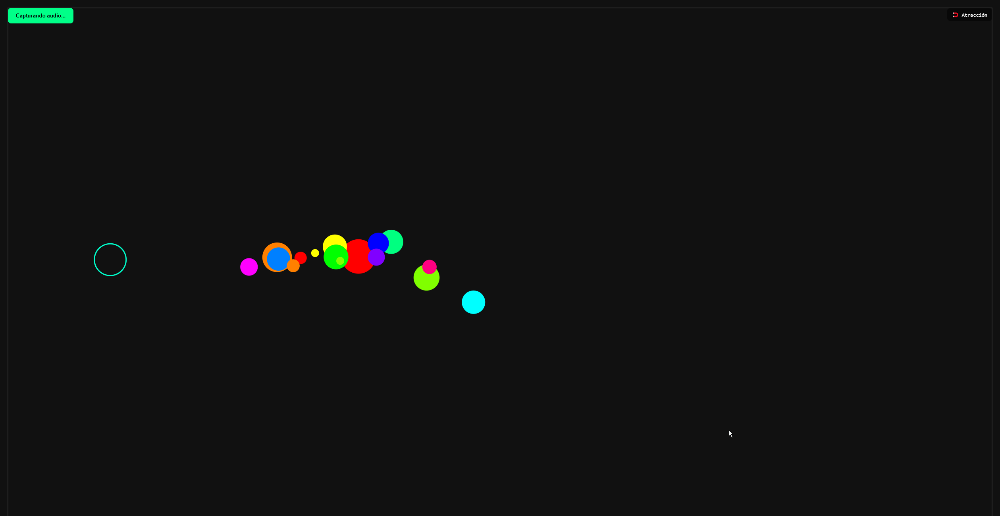
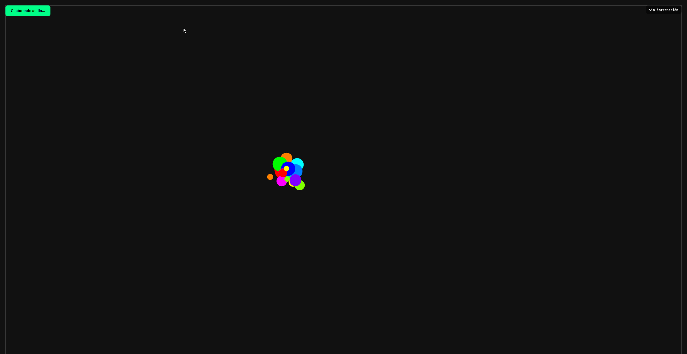
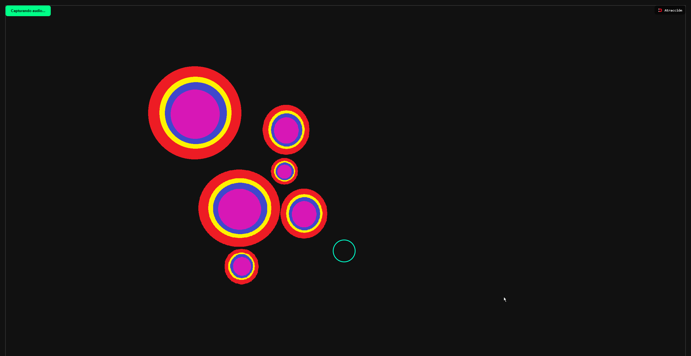
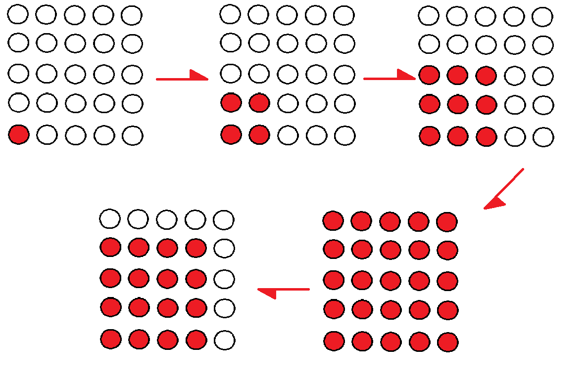
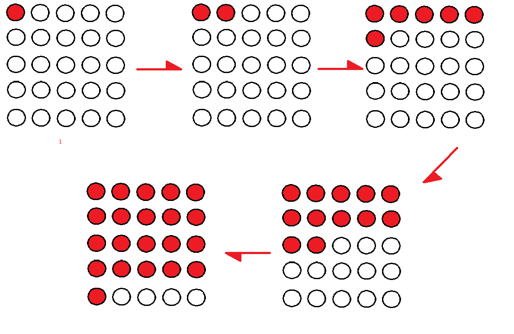
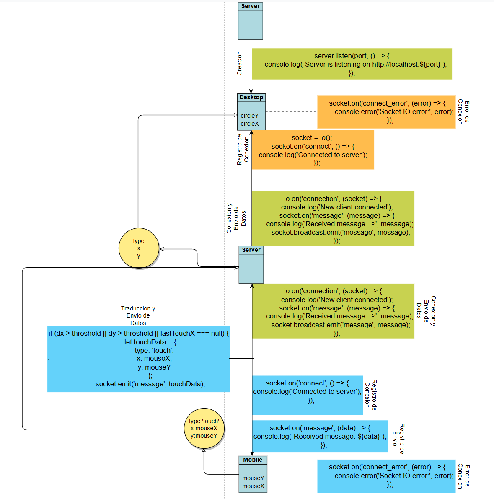
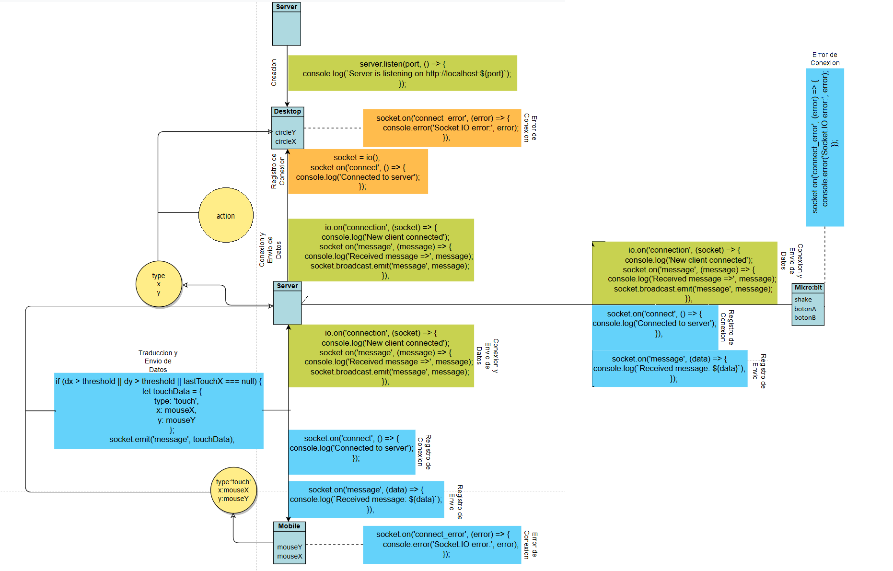

# Evidencias de la unidad 8

## Actividad 01
### Documenta los referentes visuales que te inspiren.

### Define el concepto de las visuales que quieres crear.
Usando la actividad anterior, se desea combinar los circulos, en elementos de mayor tamaño y mejor organizados en cuanto a sus colores y frecuencias, con tal de simular parlantes alrededor de la pantalla.

### Explica cómo el móvil y el micro:bit controlarán las visuales.
En cuanto a su funcion, la parte movil sigue manejando la posicion de los "parlantes" por medio de la atraccion y separacion de estos con 1 o 2 dedos respectivamente, solo que estos ya no se juntaran por completo, interactuaran como un sistema de particulas donde no pueden ocupar el espacio de otras particulas o parlantes, mientras que el micro:bit se encargara del tamaño de los parlantes (grupos de circulos) con el boton A (un modificador aplicado al tamaño de cada circulo), la cantidad de parlantes en los que se dividen los circulos con el boton B (del maximo de 16 circulos, a un minimo de 1 grupo), agitar el micro:bit podria reorganizar estos 2 factores en una forma aleatoria controlada bajo los mismos limites impuestos en sus funcionamientos (condicionales que reinician la cuenta cuando se llega al limite de 16 circulos separados para el boton B o un tamaño de x3 con el boton A)
### Haz un bocetos de todas las interfaces del sistema.
Las interfaces del lado movil y de escritorio seran las mismas que en su previo desarrollo, con el unico cambio siendo como se muestran los circulos dentro de esa interfaz de escritorio, ya que no se podran esconder detras de otro grupo. 

En cuanto a la interfaz de escritorio cambiaria la representacion de los parlantes de esta manera:

Existen 2 grupos de circulos mas de los que deberian (6 grupos de 4 circulos = 24 circulos, 8 de mas), pero se usa mas como un ejemplo de claridad sobre como funcionaria, entre mas circulos separados, mayor cantidad de colores con los cuales se dibujan.
 En cuanto al micro:bit, para el boton A, se buscaria que se encendieran los leds con base en la escala de tamaño que este siendo aplicada en el momento, iniciando con 1 led (1x1) al tamaño x0.5 y subiendo a todos los led con el tamaño maximo de x3 el tamaño original de los circulos.
 
 Para el boton B se puede mostrar un contador con base en el numero de leds encendidos, ajustando el numero de posibles circulos a la cantidad de leds que tiene el micro:bit, cuando se llega al maximo, la siguiente interaccion vuelve a encender solo 1 led.

 (las representaciones son ejemplos de como se ve el proceso sin importar el tamaño o la forma del display, especialmente con el micro:bit)
### Haz un diagrama que explique cómo se comunicarán los diferentes componentes del sistema.
Se usa el mismo diagrama anterior, pero en las posiciones de conexion al celular se agregan conexiones al micro:bit, estas siendo interacciones del mismo tipo de envio que las del movil:

